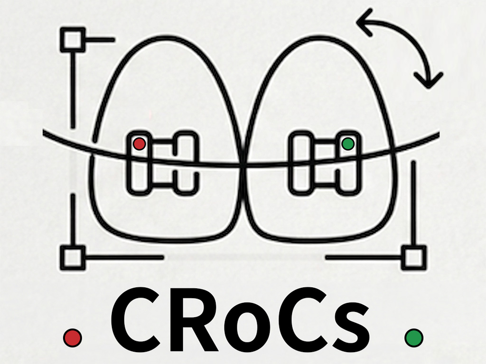
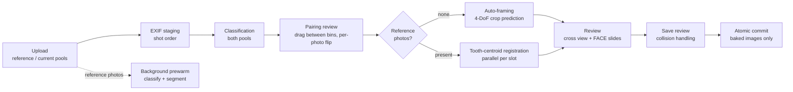

<p align="center">
  
</p>

<h1 align="center">CRoCs ⚡Fastest Lap⚡ — Crop & Rotation & Classification</h1>

<p align="center">
  A local web app that turns a batch of orthodontic photos into
  classified, registration-aligned, consistently named images — automatically.<br>
  The lightweight edition of CRoCs for solo practitioners: no patient
  management, no PPT, just photos in and photos out.
</p>

---

## Why Fastest Lap

- **Fully local.** The server runs on your own PC (`127.0.0.1:8001`). Photos
  never leave the machine, nothing is uploaded, and there are no server
  costs. It works with no internet connection — the network is used only to
  check for updates.
- **Images in, images out.** No patient list, no visit ledger, no PPT, no
  labels or note boxes. Type a folder name, drop photos, review, save.
- **First visit or follow-up is implicit.** Drop photos only into the
  *current* zone and it's a first visit. Also drop previously saved photos
  into the *reference* zone and it's a follow-up: both sides are
  auto-classified, paired per category, and the current photos are
  registered to the references using tooth centroids.
- **What you see is what is saved.** Every photo is reviewed in the exact
  window (ratio × resolution) that will be baked to disk. Existing files
  are never silently overwritten — collisions get a numbered suffix unless
  you explicitly choose to overwrite in the save review.
- **Coexists with full CRoCs.** Different port (8001), own lock file, own
  desktop shortcut, own install folder. Run both on one PC.
- **One-click updates.** Git-based updater tracking the `fastest_lap`
  branch, with a single-step rollback; model weights are distributed
  separately and verified on startup.

## Install

### Windows

Download **[`install.bat`](install.bat)** and run it. Everything
else follows:

1. Installs Git and Python via `winget` if missing
2. Asks where to install (folder picker)
3. Clones the `fastest_lap` branch and creates the virtual environment
4. Optionally creates a desktop shortcut, then points you at the `models\`
   folder for the weights

### macOS

Download **[`install.command`](install.command)** and run it from
Terminal:

```
bash ~/Downloads/install.command
```

It installs the Xcode command line tools if needed (git + python3),
asks where to install, clones the repository, sets up the virtual
environment, and offers a desktop shortcut.

**Python 3.10 or newer** is required — the code uses `str | None`, which
3.9 cannot parse. macOS ships 3.9 with the command line tools, so the
installer looks for a newer one and tells you how to get it if there is
none.

### Model weights (~400 MB)

Weights are not in the repository — binaries don't delta-compress, so they
would bloat the git history forever. Download the **8 files** (1 segmentation
· 6 framing · 1 classifier) from the provided Drive link and drop them into
`models\`. The app verifies names, sizes and hashes, moves them into place,
and tells you exactly what is missing or corrupted.

## Run

Double-click `run.bat` (Windows) or `run.command` (macOS). The server starts
on port **8001** and your browser opens. On first run you choose where the
saved photos live — **outside** the program folder, so updates never touch it.

## Pipeline



1. **Staging** — EXIF is read once per photo (orientation, capture time,
   sequence number); capture order drives FACE numbering. Reference photos
   start a **background prewarm** immediately: they are classified, framed
   and segmented while you are still reviewing, so registration has half
   its work done before you press the button.
2. **Classification** — both pools are labeled (5 intraoral views, FACE,
   OTHERS). The pairing screen shows references on top and current photos
   below, connected per category; fix mistakes by dragging, flip
   mirror-shot photos with the per-card **↕ 상하반전** button.
3. **Placement** — first visits get an initial crop from the framing
   model. Follow-ups are registered against the reference photo of the
   same category, **in parallel across slots**; unpaired categories and
   rejected registrations fall back to auto-framing with a warning badge.
4. **Commit** — each photo is baked to its visible window at the chosen
   resolution and written atomically. Only current photos are saved
   (references are last visit's output); raw copies are optional.

## Filenames & settings

Files are named `{prefix}_{category}{_n}` — e.g. `홍길동_IO_FRONT.jpg`,
`홍길동_FACE_1.jpg`. The prefix defaults to the folder name. Everything a
practice might do differently is a setting:

- **Save root** (multiple locations remembered)
- **Flip defaults** — a category × (reference/current) grid for
  mirror-shot views, with per-photo override in the UI
- **Naming** — per-category aliases, numbering mode (only when multiple /
  always), start index, separator
- **Output** — resolution (px/cm), JPG/PNG + quality, intraoral and face
  save ratios (4:3 · 3:2 · 1:1 …), flip-on-save toggle (save in the
  as-shot mirror orientation while reviewing flipped), extra shots,
  raw copies
- **After save** — open the folder in Explorer, jump to the next case

## Technical notes

### Reference photos instead of PPT reconstruction

Full CRoCs extracts registration references from the patient's PPT deck.
Fastest Lap has no deck — instead, each uploaded reference photo is framed
by the model and **baked into the review window**, which produces exactly
the same kind of image the PPT reconstruction used to yield. The
registration, overlay and anaglyph machinery from the main app therefore
survives unchanged.

### Tooth-centroid registration

Feature-point matching (ORB and friends) fails on intraoral photos — corners
land on specular highlights, saliva and wires, none of which reproduce
between visits. CRoCs instead uses the **centroids of individual teeth** from
the segmentation model as correspondence points: anatomical landmarks that
persist across visits.

- Segmentation at 1024² → per-tooth instances (center heatmap + offsets)
- A *usable* gate drops masks that can't anchor a correspondence
- **MSAC matching** pairs teeth without numbering (2-point samples)
- **Robust fitting** with MAD trimming rejects teeth that actually moved
  during treatment, then estimates a similarity transform (rotation,
  scale **and translation** — the photo lands where the reference's teeth
  are)

Because matching operates on point sets, the reference and current photos
do not need to share an aspect ratio.

### Parallelism

Slots are independent, so registration fans out over a thread pool
(`perf.pair_workers` in `config.yaml`; `0` = auto = `min(3, cores ÷ 2)`).
ONNX intra-op threads are capped to `cores ÷ workers` so the two levels of
parallelism don't fight over cores. Combined with reference prewarm this
roughly halves follow-up registration time. Per-slot progress is streamed
to the UI while it runs.

### Auto-framing

When there is nothing to register against, a per-view framing model
predicts where a human would crop — a 4-DoF similarity transform — sharing
its interface with registration so both paths run through the same
placement code. Non-4:3 save ratios keep the model's anchor (center,
rotation, scale) and simply widen the frame along the extended axis.

## Models

| Model | File | Size | Input | Runtime |
|---|---|---|---|---|
| Segmentation | `seg-*.onnx` | ~291 MB | 1024×1024 | ONNX Runtime, CPU |
| Framing × 6 (FACE + 5 IO views) | `framing_*.onnx` | ~16 MB each | view-specific | ONNX Runtime, CPU |
| Classifier | `classifier-*.onnx` | ~16 MB | 224×224 | ONNX Runtime, CPU |

All inference is CPU-only — no GPU required. Machine speed affects
processing time, not output quality.

## Architecture

| Layer | Stack |
|---|---|
| Backend | Python, FastAPI + Uvicorn (localhost only, port 8001) |
| Imaging | OpenCV, Pillow, NumPy |
| Inference | onnxruntime (CPU) |
| Frontend | Vanilla JS + CSS, no build step |
| Updates | `git pull --ff-only` on the `fastest_lap` branch + one-step rollback; weights via Drive + hash verification |

```
webapp/
  backend/     FastAPI app: classify, framing, registration, naming, updater
  frontend/    single-page UI (index.html, app.js, style.css)
  config.yaml  slot geometry, thresholds, perf — paired with code
orthoreg/      tooth segmentation & registration library
models/        weights live here after install (git-ignored)
```

## Data & privacy

- Saved photos live **outside** the repository, at a location you choose on
  first run. Updates cannot touch it.
- Everything runs offline; only the update check reaches the network.
- Saves are atomic (staged, then moved) and never silently overwrite —
  an audit log records every commit.
