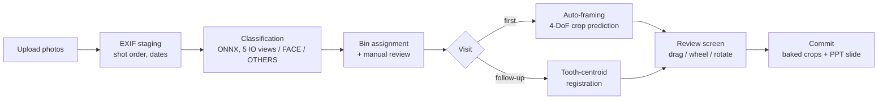

<p align="center">
  
</p>

<h1 align="center">CRoCs — Crop & Rotation & Classification</h1>

<p align="center">
  A local web app that turns a folder of orthodontic photos into an organized,
  registration-aligned PPT record — automatically.
</p>

---

## Why CRoCs

- **Fully local.** The server runs on your own PC (`127.0.0.1`). Photos never
  leave the machine, nothing is uploaded, and there are no server costs. It
  works with no internet connection — the network is used only to check for
  updates.
- **One pipeline from camera to chart.** Upload a visit's photos and CRoCs
  classifies them (5 intraoral views + face), places them into the cross-view
  layout, names and files every image, and writes the PPT slide.
- **Cross-visit registration.** Follow-up photos are aligned to the previous
  visit using tooth centroids, so the same tooth sits in the same place
  across slides and progress is visible at a glance.
- **Continues hand-made PPTs.** Existing decks made by hand are recognized
  (date/visit labels + a five-photo cross view) and new visits are appended
  in date order, inheriting the original layout, fonts and note boxes.
- **One-click updates.** Git-based updater with a single-step rollback;
  model weights are distributed separately and verified on startup.

## Install

### Windows

Download **[`install.bat`](install.bat)** and run it. Everything
else follows:

1. Installs Git and Python via `winget` if missing
2. Asks where to install (folder picker)
3. Clones the repository and creates the virtual environment
4. Optionally creates a desktop shortcut, then points you at the `models\`
   folder for the weights

### macOS

Download **[`install.command`](install.command)** and run it from
Terminal:

```
bash ~/Downloads/install.command
```

It installs the Xcode command line tools if needed (git + python3),
asks where to install, clones the repository, sets up the virtual
environment, and offers a desktop shortcut.

**Python 3.10 or newer** is required — the code uses `str | None`, which
3.9 cannot parse. macOS ships 3.9 with the command line tools, so the
installer looks for a newer one and tells you how to get it if there is
none. A virtual environment built with an older Python is rebuilt on the
next launch. A downloaded script loses
its execute bit, hence `bash` for this first run — everything the
installer creates opens with a double-click afterwards.

### Model weights (~400 MB)

Weights are not in the repository — binaries don't delta-compress, so they
would bloat the git history forever. Download the **8 files** (1 segmentation
· 6 framing · 1 classifier) from the provided Drive link and drop them into
`models\`. The app verifies names, sizes and hashes, moves them into place,
and tells you exactly what is missing or corrupted.

## Run

Double-click `run.bat` (Windows) or `run.command` (macOS). The server starts
and your browser opens. On first run you choose where patient data lives —
**outside** the program folder, so updates never touch it.

## Pipeline



1. **Staging** — EXIF is read once per photo (orientation, capture time,
   sequence number). Capture order drives face-slot assignment and visit
   dates; files keep their original timestamps.
2. **Classification** — an ONNX classifier (224 px input) labels each photo
   as one of the five intraoral views, a face photo, or other. Same-class
   photos stack in one bin, best confidence on top.
3. **Placement** — first visits get an initial crop from the framing model;
   follow-ups are registered against the previous visit's reference image
   extracted from the PPT itself.
4. **Commit** — exactly what you see is what is saved: each slot is baked to
   the visible window and written both to the patient folder and into the
   PPT slide, with filenames computed by a single shared plan.

## Technical notes

### Tooth-centroid registration

Feature-point matching (ORB and friends) fails on intraoral photos — corners
land on specular highlights, saliva and wires, none of which reproduce
between visits. CRoCs instead uses the **centroids of individual teeth** from
the segmentation model as correspondence points: anatomical landmarks that
persist across visits.

- Segmentation at 1024² → per-tooth instances (center heatmap + offsets)
- A *usable* gate drops masks that can't anchor a correspondence
  (clipped at the border, fragments)
- **MSAC matching** pairs teeth without numbering (2-point samples)
- **Robust fitting** with MAD trimming rejects teeth that actually moved
  during treatment, then estimates a similarity transform

### Pseudo-crop coordinate space

The segmenter is trained on finished, cropped photos — raw uploads are out
of distribution. Registration therefore runs a provisional "pseudo crop"
first, matches in *pseudo ↔ reference* space (both finished-grade, so the
scale candidate stays near 1), and returns the composition
`(pseudo→ref) ∘ (raw→pseudo)` as the final raw→reference transform.
Resolution ratios never leak into the estimated scale.

### Auto-framing

For first visits there is no reference to register against. A per-view
framing model predicts where a human would crop — a 4-DoF similarity
transform (position, scale, rotation) — and shares its interface with
registration (transform + confidence + ok flag), so first and follow-up
visits run through the same placement code. Low confidence falls back to
plain cover-fit.

### Layout recognition & hand-made decks

A slide counts as a cross view if it holds five photos each ≥ 8 cm wide, or
photos placed by the app (named shapes). Date/visit labels are parsed with
the user's registered label formats. New visit slides are inserted after the
**latest-dated** cross-view slide (not the last slide), so decks with mixed
slide orders still grow correctly, and every other slide — faces, x-rays,
patient info — is left untouched.

### Naming engine

Folder, PPT and label formats are assembled from blocks (name, hospital ID,
ortho ID, separators, recognition-only wildcards) in the settings UI. The
first format creates new folders; every registered format is used for
recognition, so renaming conventions can evolve without breaking old
records. Patient files are never renamed — they are medical records.

## Models

| Model | File | Size | Input | Runtime |
|---|---|---|---|---|
| Segmentation | `seg-*.onnx` | ~291 MB | 1024×1024 | ONNX Runtime, CPU |
| Framing × 6 (FACE + 5 IO views) | `framing_*.onnx` | ~16 MB each | view-specific | ONNX Runtime, CPU |
| Classifier | `classifier-*.onnx` | ~16 MB | 224×224 | ONNX Runtime, CPU |

All inference is CPU-only — no GPU required. Machine speed affects
processing time, not output quality.

## Architecture

| Layer | Stack |
|---|---|
| Backend | Python, FastAPI + Uvicorn (localhost only) |
| Imaging | OpenCV, Pillow, NumPy |
| PPT | python-pptx (read/write, shape-level layout) |
| Inference | onnxruntime (CPU) |
| Frontend | Vanilla JS + CSS, no build step |
| Updates | `git pull --ff-only` + one-step rollback; weights via Drive + hash verification |

```
webapp/
  backend/     FastAPI app: classify, framing, registration, PPT I/O, updater
  frontend/    single-page UI (index.html, app.js, style.css)
  config.yaml  slot geometry, thresholds, naming defaults — paired with code
orthoreg/      tooth segmentation & registration library
templates/     PPT templates (paired with config)
models/        weights live here after install (git-ignored)
```

## Data & privacy

- Patient data lives **outside** the repository, at a location you choose on
  first run. Updates cannot touch it.
- The repo ignores `data/` and `*.pptx` as a second line of defense —
  patient material cannot slip into version control.
- Everything runs offline; only the update check reaches the network.
